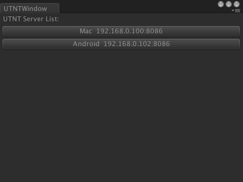
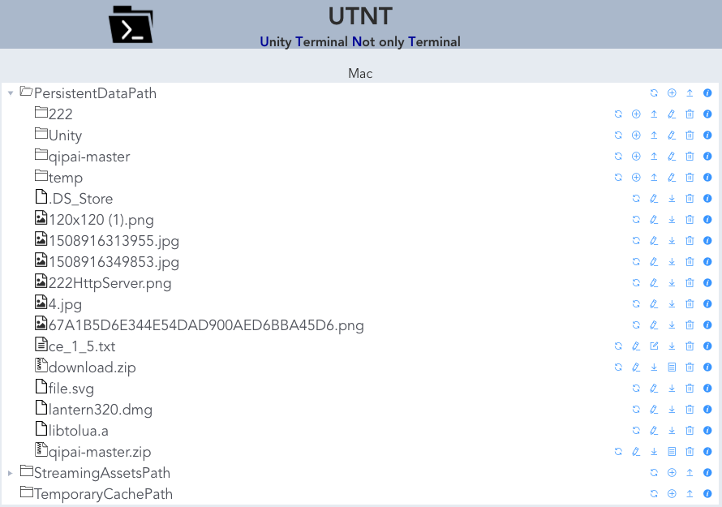
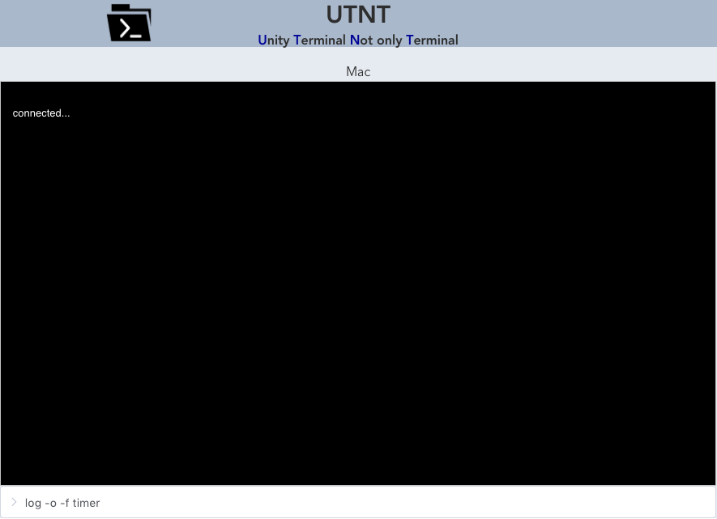
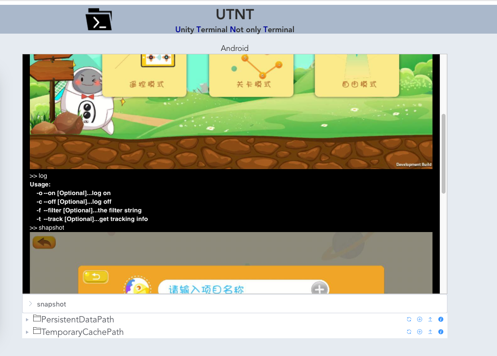
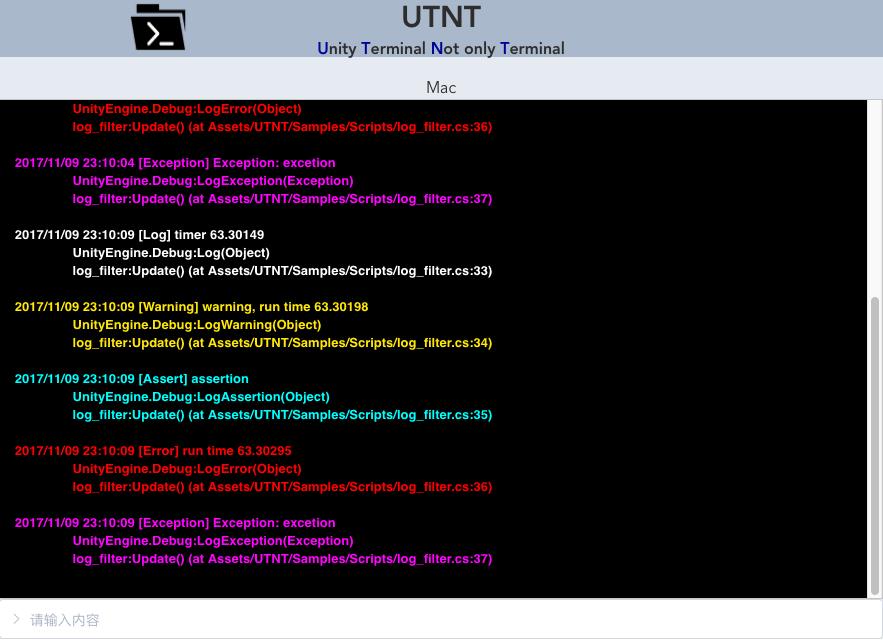
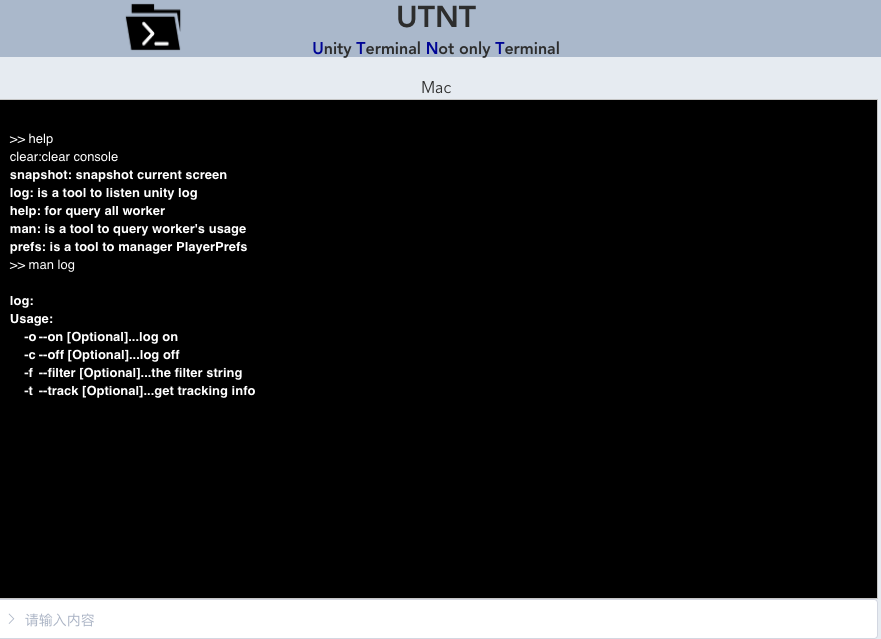

UTNT
================

1 Start
-------

1)  First,when you get this package,please import this in unity by "Assets/Import Package/Custom Package...";

2)  Then you should move the Folder "UTNT/StreamingAssets"to your project's root folder(the Assets folder), if you had the same folder,just merge the two, then you got the path "Assets/StreamingAssets";

3)  And you can select one sample sence from path "UTNT/Samples/Scenes",and play this scene;

4)  Open your web browser, input the url like <http://localhost:8086>, then you can use UTNT;if you build this project to you mobile  phone,you can use the url lik [http://ip:port](http://ip:port), the ip means your device ip in LAN,and if you not change the port,default port is 8086;

> Or you can use the tool in UnityEditor "Tools/UTNTWindow",this tool
> can scan all server in LAN(if this window show nothing,you can reopen
> this window);
>
> 

5)  Terminal With Some inner command:

    a.  clear: clear current screen;

    b.  help: show all registed worker;

    c.  man: show how to use one worker;

> 

    d.  up/down key can select command you had used;

6)  There has some sample, and with source code:

    a.  log\_filter: a demo. To show how to use log;

> 

b.  material\_worker: to show how to change object's material color,with
    source code;

c.  only\_resmgr: show just use resource manager,without terminal;

d.  shapshot: a demo to show capture current screen;

> 

e.  transform\_worker: show how to control transform;

2 Resource Manager
------------------

1)  this function can manager the spatial unity folder,and modify the
    file which can edit on this platforme; you can upload or download
    the file;



2)  default editable text file extension with .txt/.lua/.xml,and you can
    add other extions by code:

> WebServer.AddEditableFileExtion(\".ext\");

3)  you can upload file to a editable folder,if the if is zip or rar
    file,you can unzip the file by the uzip function button;

3 Unity Terminal
----------------

1)  this tool is a framework to connect unity player, the connection is
    runtime,you can do many things by this terminal;



> tips:

a.  default termila will not start, you must enable by yourself with
    code, like:

> WebServer.EnableTerminal(8087,\"log -o -f timer\", 1000);

b.  when you use this in editor,please enable your project run in
    background:

> Application.runInBackground = true;

2)  use terminal,you just input command in the input filed;then the
    screen will show the return;

> you even can extend the terminal work very easy,you just need to
> implement the interface IWorker,more you can see the samples;

``` c#
//the command you input in terminal
   string GetName();

//on input field commit
   string Do(Connect conn, MessageModel request, string args);

//on this connect closed
   void OnClose(Connect conn);

//return how to use this worker
   string Usage();

//return the desc. About worker
   string Description();
```

3)  the function

```c#
 string Do(Connect conn, MessageModel request, string\[\] args)
```
> return the string will to show on terminal with default style,you can
> return null,and terminal show nothing;
>
> or you can send to terminal by yourself with your style,if you use
> Connect's interface,such as SendText and SendImage,more detail in
> LogWorker code;

4)  regist your worker into UTerminal:

> UTerminal.Instance.Regist(new LogWorker());

4 Others
--------

UTNT used some others libraries,like ICSharpCode.SharpZipLib/
websocket-sharp/WebServer, but I changed some code of websocket-sharp
and websever,to avoid namespace conflict,I changed the the namespace of
those two;when you publish your project,you can remove UTNT from your project;
